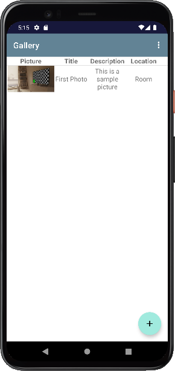

# Pointless Gallery

## Description

**Pointless Gallery** is, as its name suggests, a completly useless gallery for Android. It is not pretty nor intuitive and there are not many features. I just made this application for an university class and I really enjoyed doing it. Mainly because of the Kotlin language which was new for me, but also because of the Room library used to work with the database.

This app allows you to:

- Add pictures from your phone storage
- Associate a title, a description and a location to these pictures
- View your pictures
- Put some pictures as favorites
- Delete your added pictures

## Screenshots

### Home Page

### Add Picture

### Show Picture

*This application has been made in the context of the course **Mobile App Development*** of the AGH University (Poland) in the year 2022.

